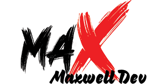

 Hi, I'm MAX

I'm a seasoned JavaScript developer with deep expertise in React and HTML, and I also specialize in security testing and pentesting. Over the years, I've worked on various private projects, primarily dealing with legacy systems. Recently, I've transitioned to stricly open-source development, focusing on today’s modern technologies and trends.

Currently, I’m focused on creating JavaScript testing libraries, web templates, boilerplates, and React component libraries. I'm also integrating AI into some of my projects and continuously expanding my knowledge of the latest developments and AI frameworks.

As I continue to grow and contribute, I’m open to sponsorships and donations to help support my open source work.
👋
👋
👋

**Community**
- Open-Source-Advocate
- Try hack me top 5%
- React Community
- Coding Ninja
- Github Developer Group

  

